# MSCS-634 Lab 1: Data Visualization, Data Preprocessing, and Statistical Analysis


## Purpose of This Lab

The goal of this lab was to get hands-on experience with the core stages of a data science workflow using Python in a Jupyter Notebook environment on Google Colab. The lab covers three main areas: data visualization, data preprocessing, and statistical analysis.

Two datasets were used throughout the lab. The first, `bmw_global_sales_2018_2025.csv`, was sourced from Kaggle and contains BMW global sales data from 2018 to 2025 across multiple regions, models, and economic indicators — this was used for the visualization steps. The second, `synthetic_dataset.csv`, is a retail product dataset with columns for Category, Price, Rating, Stock, and Discount. Since the BMW dataset had no missing values, this second dataset was specifically chosen for preprocessing because it contains significant missing data across all columns, making it well-suited for demonstrating imputation and cleaning techniques.

**Datasets:**
- [BMW Global Automotive Sales (2018–2025)](https://www.kaggle.com/datasets/dmahajanbe23/bmw-global-automotive-sales) — Kaggle
- [Retail Product Dataset with Missing Values](https://www.kaggle.com/datasets/himelsarder/retail-product-dataset-with-missing-values) — Kaggle

---

## Repository Contents

```
MSCS_634_Lab_1/
├── MSCS_634_Lab1.ipynb             # Jupyter Notebook with all code and outputs
├── bmw_global_sales_2018_2025.csv  # BMW global sales dataset (used for visualization)
├── synthetic_dataset.csv           # Retail product dataset (used for preprocessing & stats)
├── README.md                       # This file
└── Screenshots/                    # All the screenshots uploaded in this folder
```
---

## Key Insights from Visualizations and Statistical Measures

### Step 1 — Data Collection

The `bmw_global_sales_2018_2025.csv` dataset was uploaded to Google Colab and loaded into a pandas DataFrame using `pd.read_csv()`.

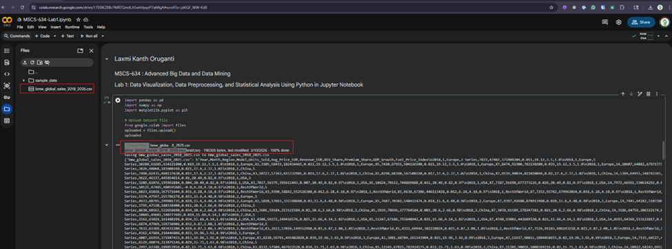

I used `df.sample(500)` instead of `df.head()` to preview the data, since sampling random rows gives a more representative sense of the dataset's diversity rather than just showing the first few consecutive entries.

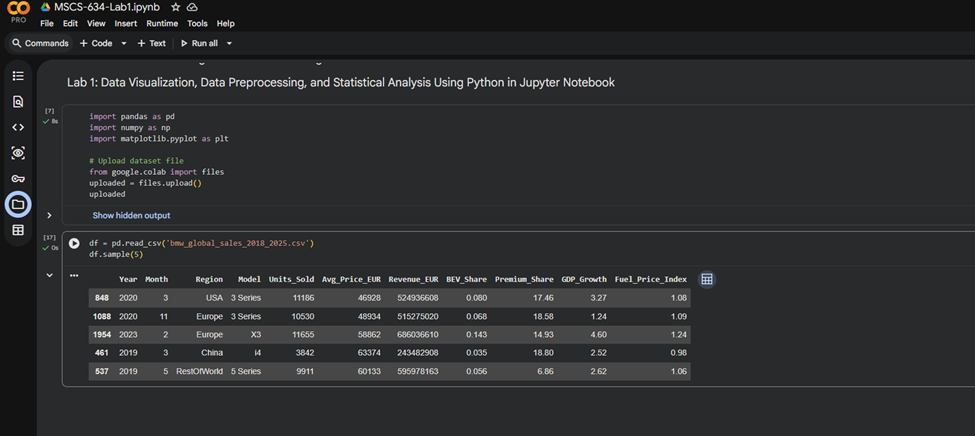

The sample confirmed that the dataset is well-structured, with records spanning years 2018–2025, regions (USA, Europe, China, RestOfWorld), and BMW models (3 Series, X3, S Series, and others). The full dataset includes 11 columns: `Year, Month, Region, Model, Units_Sold, Avg_Price_EUR, Revenue_EUR, BEV_Share, Premium_Share, GDP_Growth, and Fuel_Price_Index`.

---

### Step 2 — Data Visualization

**Bar Chart — Units Sold per Year**

The bar chart plots units sold (y-axis) against year (x-axis) using `plt.bar()`. The visualization reveals a clear upward trend in BMW global sales over the period, with sales volumes increasing steadily from approximately 11,000–12,000 units in 2018 to a peak of around 16,000 units by 2025. This indicates strong, sustained market demand for BMW vehicles across all regions during this period.

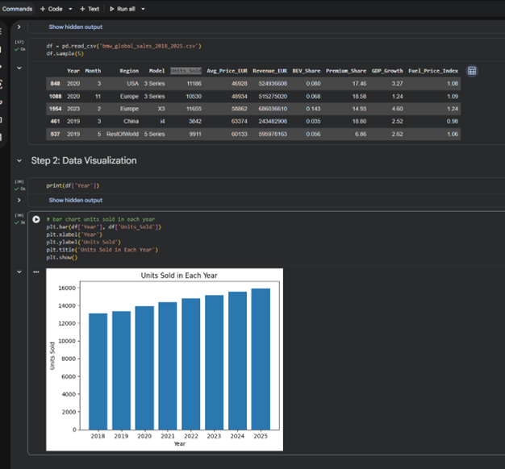

**Scatter Plot — GDP Growth vs. BEV Share by Region**

The scatter plot shows the relationship between GDP Growth and BEV Share (Battery Electric Vehicle penetration percentage), with data points color-coded by region. A few notable observations came out of this:

- China exhibits notably higher BEV Share values (up to 0.20, or 20%) across varying GDP growth rates, which reflects its aggressive EV adoption strategy driven by government policy and subsidies.
- Europe shows moderate clustering in the mid-range BEV share, while the USA and Rest of World show lower, more dispersed penetration.
- There is no strong linear correlation between GDP growth and BEV share across any region. This suggests that EV adoption is driven more by regional policy and infrastructure than by economic growth alone — an insight that wouldn't be as clear without this kind of visualization.

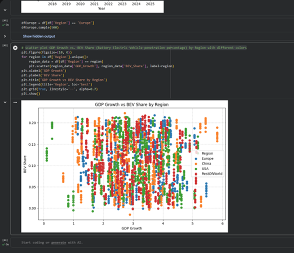

---

### Step 3 — Data Preprocessing

Since the BMW dataset had no missing values, I uploaded a second dataset (`synthetic_dataset.csv`) specifically for the preprocessing steps.

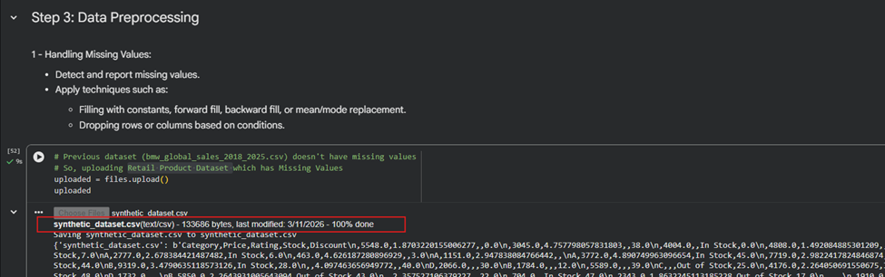

**Detecting Missing Values**

Running `isnull().sum()` on the retail dataset revealed missing values across all five columns: Category (2,748 missing), Rating (2,050 missing), Stock (1,352 missing), Discount (392 missing), and Price (174 missing). The 10-row sample view also clearly showed NaN values scattered across multiple rows and columns, confirming that significant incompleteness needs to be addressed before any analysis.

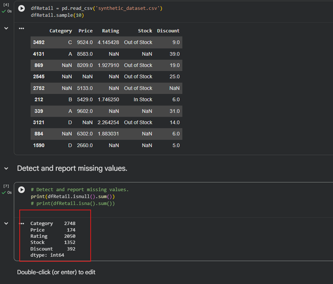

**Handling Missing Values**

Two different imputation strategies were applied side by side, using `.copy()` each time to preserve the original data for comparison.

First, the mean, median, and mode were calculated for the columns that needed filling:

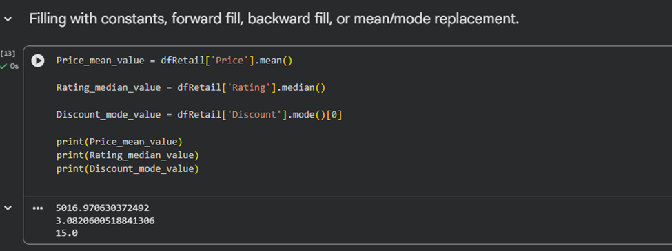

**Statistical imputation:** Price was filled with the column mean (~5,017), Rating with the median (~3.08), and Discount with the mode (15). Looking at the output, row #5 shows Rating and Discount filled with the median and mode respectively, and row #17 shows Price replaced with the mean. This approach is good for preserving the statistical distribution of each column.

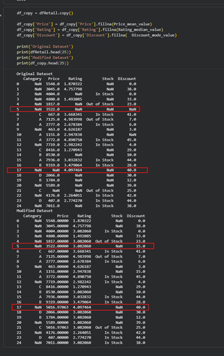

**Forward fill, backward fill, and constant fill:** Rating was forward-filled (using the last observed value), Discount was backward-filled (using the next observed value), and Category was filled with the constant string `'Unknown'`. In the output, row #5 shows the Category filled as "Unknown," Rating forward-filled from row #3, and Discount backward-filled from row #6. This approach works well when data has a sequential or temporal ordering.

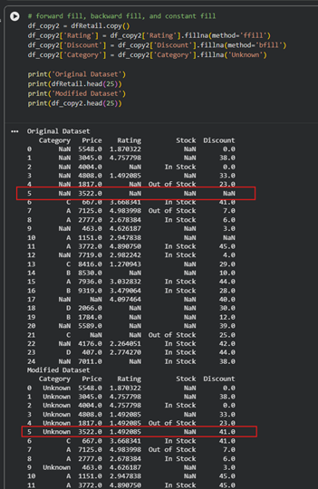

**Outlier Detection**

Two outlier detection methods were applied:

- **IQR method** on the Discount column: lower bound = Q1 − 1.5×IQR, upper bound = Q3 + 1.5×IQR. Result: **0 outliers**.
- **Standard Deviation method** on the Rating column: bounds at mean ± 3×std. Result: **0 outliers**.

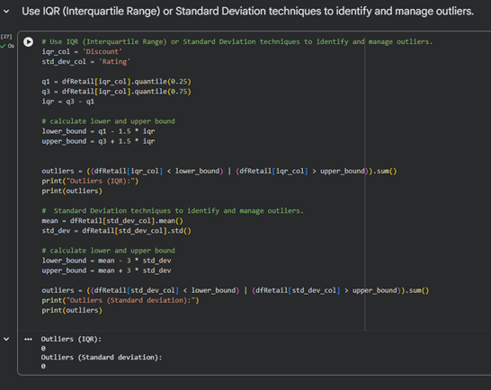

Both methods returning zero outliers makes sense here — the dataset was synthetically generated with bounded value ranges (Discount: 0–49, Rating: 1–5), so no values fall outside the expected statistical range. This is worth noting because missing data and outliers are separate problems; the columns are clean from an extreme-value perspective even though they contain missing data.

**Data Reduction**

Two forms of data reduction were demonstrated:

- **Row sampling:** `df.sample(n=50)` reduced the dataset to 50 rows, and `df.sample(frac=0.2)` produced a 20% random subset of 872 rows. Both allow faster experimentation while preserving the general statistical properties of the full 4,362-row dataset.

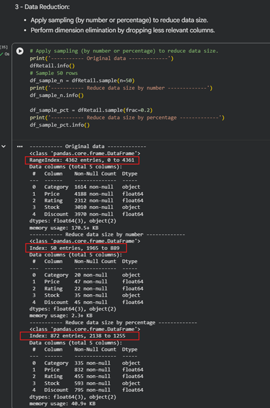

- **Dimension elimination:** `Category` and `Stock` were dropped using `df.drop()`. The original DataFrame had 5 columns and ~170.5 KB of memory usage; after dropping those two, the reduced DataFrame (`df_reduced`) kept only Price, Rating, and Discount, bringing memory usage down to 102.4 KB. These columns were chosen for removal because they are categorical, have high missing rates, and are not needed for the numerical operations that follow.

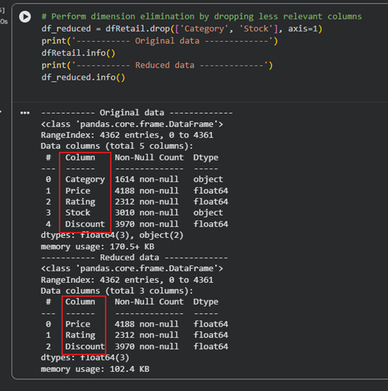

**Data Scaling**

Three normalization techniques were applied to the Price column:

**Min-Max Scaling:** Formula: `Price_MinMax = (Price − min) / (max − min)`, mapping all values to [0, 1]. The resulting column has a mean of ~0.497 and spans exactly 0.000 to 1.000, confirming it mirrors the original distribution at a normalized scale. This is useful for algorithms sensitive to absolute feature magnitude, like k-nearest neighbors or neural networks.

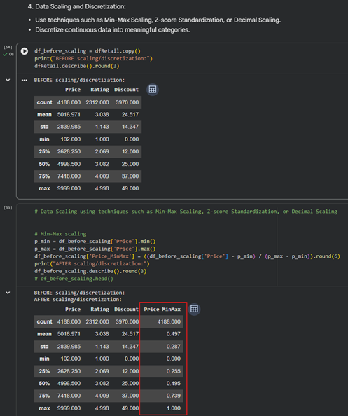

**Z-Score Standardization:** Formula: `Price_Zscore = (Price − mean) / std`, resulting in mean = 0 and std = 1. The output shows a minimum of −1.731 and maximum of 1.754, indicating a centered, symmetric distribution with no extreme outliers. This is better suited for algorithms that assume or benefit from normally distributed input, such as SVM and PCA.

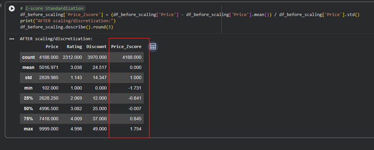

**Decimal Scaling:** Formula: `Price_Decimal = Price / 10^j`, where j is determined by the number of digits in the maximum value. Since the max Price is 9,999 (4 digits), all values are divided by 10,000. This brings the entire range within (0, 1). Rows with missing Price values result in NaN in the scaled column, which is the expected behavior since missing values propagate through arithmetic operations.

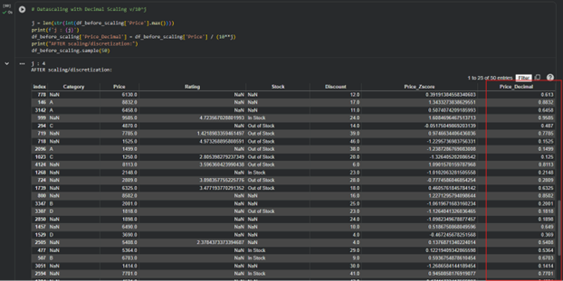

**Discretization**

`pd.cut()` was used to bin continuous columns into labeled categories:

- `Price` → **Budget**, **Mid-range**, **Premium** (3 equal-width bins over the range [102, 9999]), stored in `Price_Category`
- `Rating` → **Poor** (0–2), **Average** (2–3.5), **Good** (3.5–4.5), **Excellent** (4.5–5), stored in `Rating_Label`

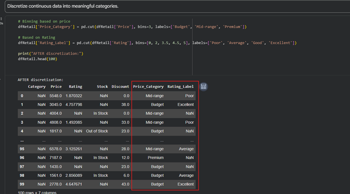

Rows with missing Price or Rating values produce NaN labels in the new columns, which is correct — there's no basis for assigning a category to an unknown value without additional imputation first. Discretization like this is especially useful for decision tree models and exploratory reporting.

---

### Step 4 — Statistical Analysis

**Dataset Overview**

`.info()` confirmed that the DataFrame has 4,362 entries (indexed 0 to 4,361) across 5 columns: Category (object, 1,614 non-null), Price (float64, 4,188 non-null), Rating (float64, 2,312 non-null), Stock (object, 3,010 non-null), and Discount (float64, 3,970 non-null), with ~170.5 KB memory usage. `.describe()` on the numeric columns showed Price ranging from 102 to 9,999 (mean ≈ 5,017, std ≈ 2,840), Rating from 1.0 to 4.998 (mean ≈ 3.038), and Discount from 0 to 49 (mean ≈ 24.517).

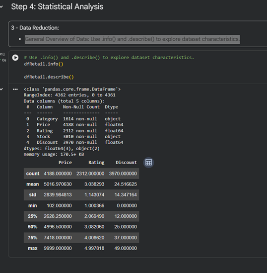

**Central Tendency and Dispersion Measures — Price Column**

The central tendency and dispersion measures were computed for the Price column:

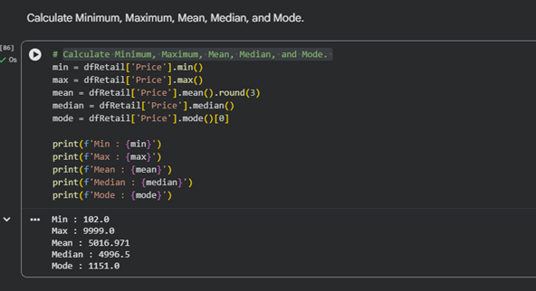

| Measure            | Value        |
|--------------------|--------------|
| Minimum            | 102.0        |
| Maximum            | 9,999.0      |
| Mean               | 5,016.971    |
| Median             | 4,996.5      |
| Mode               | 1,153.0      |
| Range              | 9,897        |
| Q1 (25th pct)      | 2,628.25     |
| Q3 (75th pct)      | 7,418.00     |
| IQR                | 4,789.75     |
| Variance           | 8,065,513.74 |
| Standard Deviation | 2,839.98     |

The mean and median are very close together (~5,017 vs ~4,997), which suggests the Price distribution is approximately symmetric and not heavily skewed. The large IQR of ~4,790 confirms that the middle 50% of prices spans nearly half the total price range. The high standard deviation relative to the mean indicates substantial variability in pricing — scale-sensitive algorithms would definitely need feature normalization applied first.

**Correlation Matrix**

The Pearson correlation matrix was computed using `dfRetail.corr(numeric_only=True)` for the three numeric columns.

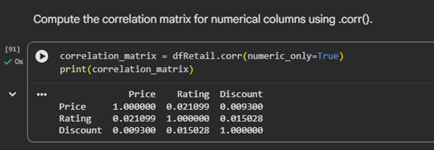

All pairwise correlations are extremely close to zero: Price–Rating = 0.021, Price–Discount = 0.009, and Rating–Discount = 0.015. This confirms that the three numeric features have essentially no linear relationship with each other, which makes sense given that the dataset was synthetically generated with independently drawn values. Practically, this means none of these features can reliably predict the others through linear regression alone — more complex non-linear models or additional feature engineering would be needed to uncover any predictive structure.

---

## Challenges Faced and Decisions Made

1. **No missing values in the primary dataset:** The BMW sales dataset had no missing values at all, so I had to bring in a second dataset (the synthetic retail CSV) just to demonstrate the preprocessing steps. This meant working with two different datasets in the same notebook, which required keeping clear variable names (`df` vs `dfRetail`) to avoid confusion.

2. **Choosing between imputation strategies:** Rather than picking one approach and moving on, I demonstrated multiple strategies side by side using `.copy()` to preserve the original data. This made it easier to compare how forward fill, backward fill, mean fill, and constant fill each behave differently on the same rows.

3. **Pandas deprecation warning:** Using `fillna(method='ffill')` and `fillna(method='bfill')` triggered a `FutureWarning` from pandas, since newer versions expect `.ffill()` and `.bfill()` instead. I kept the original syntax in the notebook for clarity, but this is something to update for future compatibility.


4. **Zero outliers was the correct result, not an error:** Both IQR and standard deviation methods returned zero outliers for Discount and Rating. This is expected because the synthetic dataset was generated within fixed bounds, so there are no extreme values to detect. I made sure to document this rather than second-guess the result.

5. **Decimal scaling factor is computed dynamically:** Instead of hardcoding the divisor, `j` is calculated from `len(str(int(max_value)))`, so it automatically picks the right power of 10 based on the data. This makes the implementation work correctly for any column, not just Price.
